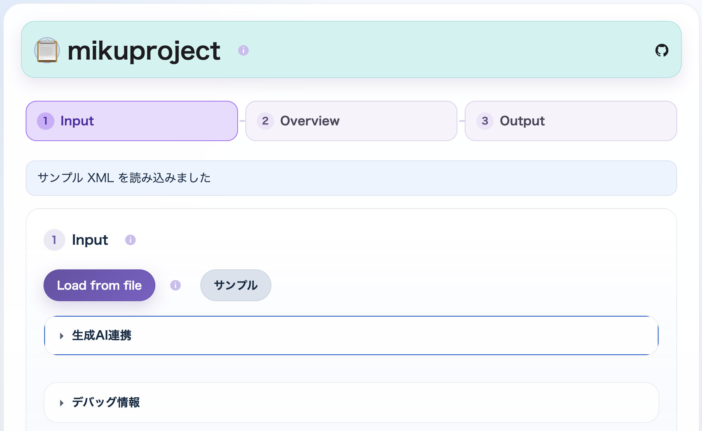
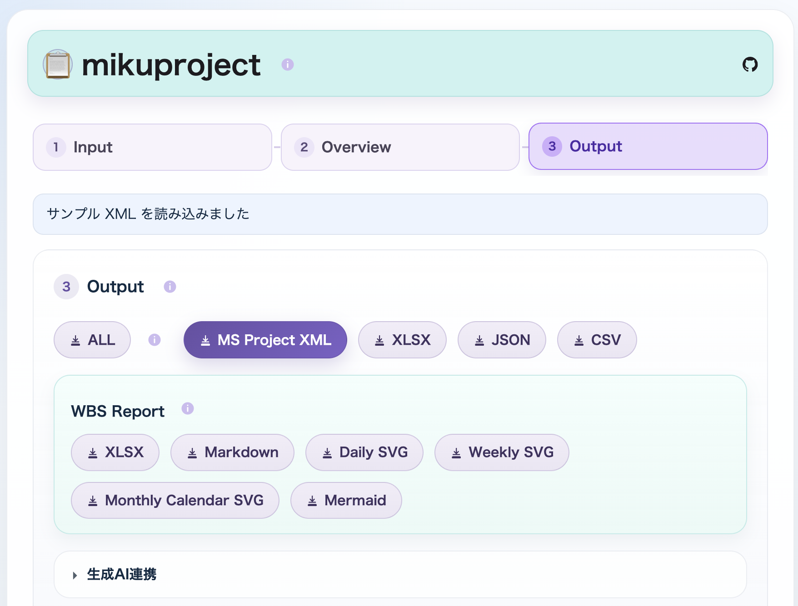
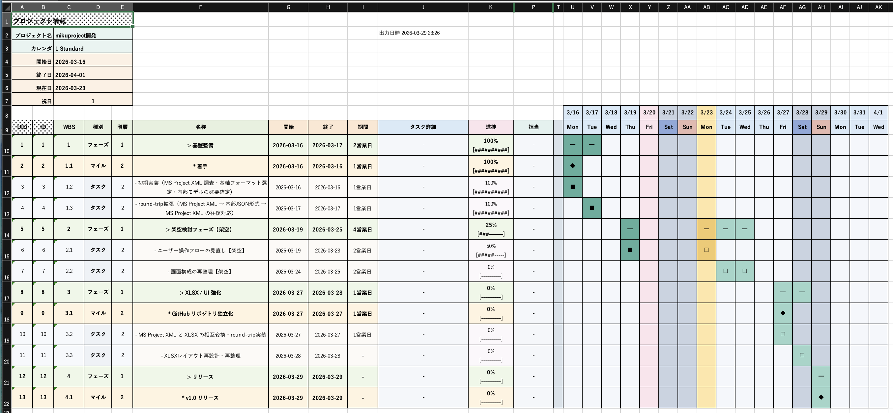

# mikuproject


GitHub: https://github.com/igapyon/mikuproject

`mikuproject` は、`MS Project XML` を基軸に、変換・可視化・限定編集を行うローカル HTML ツールです。

`mikuproject` の強みは、同じプロジェクト情報を 1 つの意味体系のまま、用途に応じて複数の形式へ出し分けられることです。`MS Project XML` を基軸に、`XLSX`、`Markdown`、`JSON`、`Mermaid`、生成AI向け表現、そして必要に応じて `MS Project` へも橋渡しできるため、資料共有・レビュー・変換・再利用のそれぞれの場面に合わせて、無理なく形を変えて届けられます。

特に、次の 3 つを重視して設計しています。

- `MS Project XML` を基軸にした変換・可視化・限定編集
- 生成AI 連携を意識した projection / 再取込
- 人が読むための `WBS Excel ブック (.xlsx)` 帳票出力

配布物は `mikuproject.html` ひとつの single-file web app で、Web ブラウザさえあればインストール不要・ネットワーク不要で利用できます。

`MS Project XML` を意味の基軸として扱い、`.xlsx` と workbook JSON は確認・可視化・限定編集のための周辺表現として扱います。生成AI 連携の編集用 JSON は、workbook JSON と区別するため当面 `.editjson` 拡張子を推奨します。

## 代表的なユースケース

- その1: 管理用の Excel ブックに必要な情報を入力し、`mikuproject` を用いて `WBS Excel ブック (.xlsx)` 形式へ変換する
- その2: 生成AI に専用プロンプトをセットして会話し、WBS 草案を作成する。生成された JSON を `mikuproject` へ入力し、`WBS Excel ブック (.xlsx)` 形式へ変換する
- その3: `MS Project` のデータを `MS Project XML` 形式でエクスポートし、それを入力として `WBS Excel ブック (.xlsx)` 形式へ変換する

## スクリーンショット

### Input

`Load from file`、`サンプル`、`生成AI連携` から入力を受け付ける。



### Overview

`Daily / Weekly / Monthly Calendar` preview をここで行う。


### Overview Monthly Calendar

`Overview` では `Monthly Calendar` preview も確認できる。


### Output

`MS Project XML`、`XLSX`、workbook JSON、`WBS XLSX`、Mermaid、生成AI向け `.editjson` をここから保存する。



### WBS Excel ブック (.xlsx)

人が読むための帳票として出力される `WBS Excel ブック (.xlsx)` の例。



### WBS Markdown

`WBS ツリー` と `WBS テーブル` を含む `Markdown` 出力の例。


## できること

- `MS Project XML` の読込
- `ProjectModel` への変換と内容確認
- `MS Project XML` の再生成
- Mermaid gantt テキスト生成
- `CSV + ParentID` のファイル読込とダウンロード
- 構造忠実な `Project / Tasks / Resources / Assignments / Calendars` workbook の `XLSX Export / Import`
- 構造忠実な `Project / Tasks / Resources / Assignments / Calendars` workbook の `JSON Export / Import`
- 表示専用の `WBS XLSX Export`
- 生成AI向け `project_overview_view` / `phase_detail_view` / `full bundle` の出力
- 生成AIが返した `project_draft_view` の取込

## 使い始め方

もっとも簡単なのは、生成済みの [mikuproject.html](mikuproject.html) をブラウザで開く方法です。

画面上では主に次を行えます。

- `Load from file` からの `MS Project XML / XLSX / workbook JSON (.json) / 生成AI向け編集用 JSON (.editjson) / CSV + ParentID` の読込
- `project_draft_view` ベースで生成したサンプル XML の読込
- 生成AIが返した `project_draft_view` の JSON 貼り付け取込
- 内部モデル、validation、`Daily / Weekly / Monthly Calendar` preview の確認
- `MS Project XML / XLSX / WBS XLSX / workbook JSON / CSV + ParentID / Daily SVG / Weekly SVG / Monthly Calendar SVG / Mermaid / 生成AI向け .editjson` の保存
- 主要成果物をまとめた `ALL` ZIP の保存

主な保存名の例:

- `Daily SVG`: `mikuproject-wbs-daily-<YYYYMMDDHHmm>.svg`
- `Weekly SVG`: `mikuproject-wbs-weekly-<YYYYMMDDHHmm>.svg`
- `Monthly Calendar SVG`: `mikuproject-monthly-wbs-calendar-<YYYYMMDDHHmm>.zip`
- `ALL`: `mikuproject-all-<YYYYMMDDHHmm>.zip`

`Monthly Calendar SVG` の ZIP 内では、月別ファイルを `monthly-calendar/YYYY-MM.svg` の形で格納します。

### Windows 11 での `SVG` / `ZIP` 取扱いメモ

- `Monthly Calendar SVG` は、月ごとの `SVG` をまとめた `ZIP` として保存される
- `ALL` も、複数の成果物をまとめた `ZIP` として保存される
- `Windows 11` では、ダウンロードした `ZIP` や `SVG` が「危険なファイル」として警告される場合がある
- これは `mikuproject` 固有の独自拡張ではなく、`ZIP` や `SVG` を Windows 側が外部由来ファイルとして慎重に扱う場合があるため
- 少なくとも `Monthly Calendar SVG` と `ALL` の `ZIP` は、アプリ内で生成した成果物をまとめたもの
- 警告の有無や表示文言は、利用するブラウザや Windows の設定に依存する可能性がある

## 開発

```bash
npm install
npm run build:js
npm run build:html
npm run build:xlsx-sample
npm test
npm run build
```

`npm run build` は `build:app` と `test` を順に実行する。`build:app` は `build:web` と `build:xlsx-sample` を順に実行する。

`local-data/` は確認用の再生成可能な生成物置き場として扱う。ここに出す sample や検証用出力は、Git 管理下の永続成果物ではなく、必要時に再生成できればよい前提とする。

## 関連ドキュメント

- [docs/architecture.md](docs/architecture.md)
- [docs/spec.md](docs/spec.md)
- [docs/gap-notes.md](docs/gap-notes.md)
- [docs/mikuproject-ai-json-spec.md](docs/mikuproject-ai-json-spec.md)
- [docs/msprojectxml-ai-integration.md](docs/msprojectxml-ai-integration.md)
- [THIRD-PARTY-NOTICES.md](THIRD-PARTY-NOTICES.md)
- [docs/TODO.md](docs/TODO.md)
- [CONTRIBUTING.md](CONTRIBUTING.md)
- [CONTRIBUTORS.md](CONTRIBUTORS.md)
- [CODE_OF_CONDUCT.md](CODE_OF_CONDUCT.md)
- [LICENSE](LICENSE)
